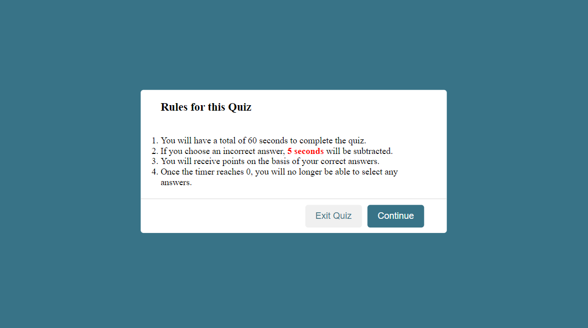

# <beginner-coding quiz>

## Description

For this project, our job was to create a quiz that was timed and had certain rules. 

While completing this project, I learned how hide an element with a click function in JavaScript. 

## Usage

Please read the rules before pressing the "Continue" button.

https://allstarcoding777.github.io/beginner-coding-quiz/

## License

Please refer to the license in the repo.